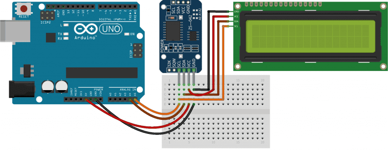

## Essentials

| Arduino UNO R3 | jumper wire |
| ------------- | ------------- |
| beard bord | LCD 1602 + I2C |
| DS3231 | for clock and calender |

## Map

Building a reliable physical clock with some electrical knowledge and an Arduino board

If you're interested in building your own physical clock, it's easier than you might think! All you need is some basic electrical knowledge and an Arduino board. An Arduino is a microcontroller board that allows you to create all sorts of electronic projects with ease.

To build a clock, you'll need a few additional components, including a clock mechanism, an LCD display, and some buttons for setting the time. Once you have all the necessary parts, you can begin programming your Arduino to control the clock mechanism and display the time on the LCD screen.
One of the great advantages of building your own clock is that you can customize it to your liking. You can choose the size, shape, and color of the clock face, as well as the style of the hands. You can also add additional features, such as an alarm or a timer. Overall, building your own clock can be a fun and rewarding project that allows you to flex your creative and technical muscles. With a little bit of knowledge and some patience, you can create a reliable and stylish timepiece that you'll be proud to display in your home or office.
